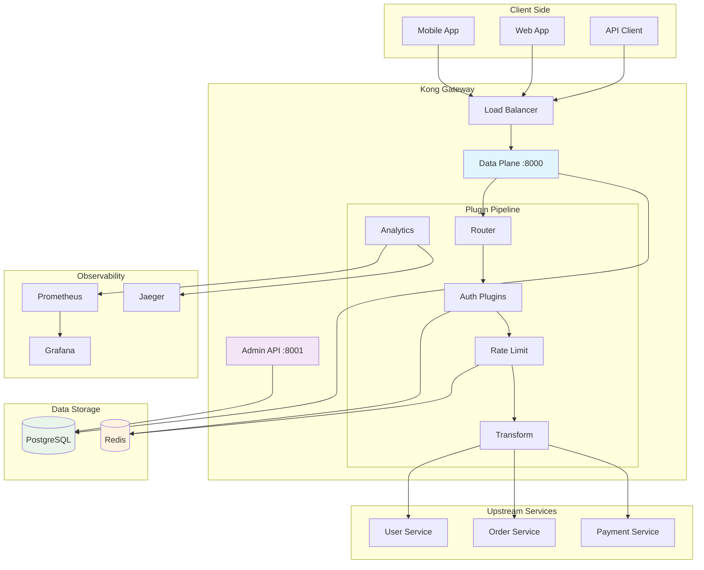
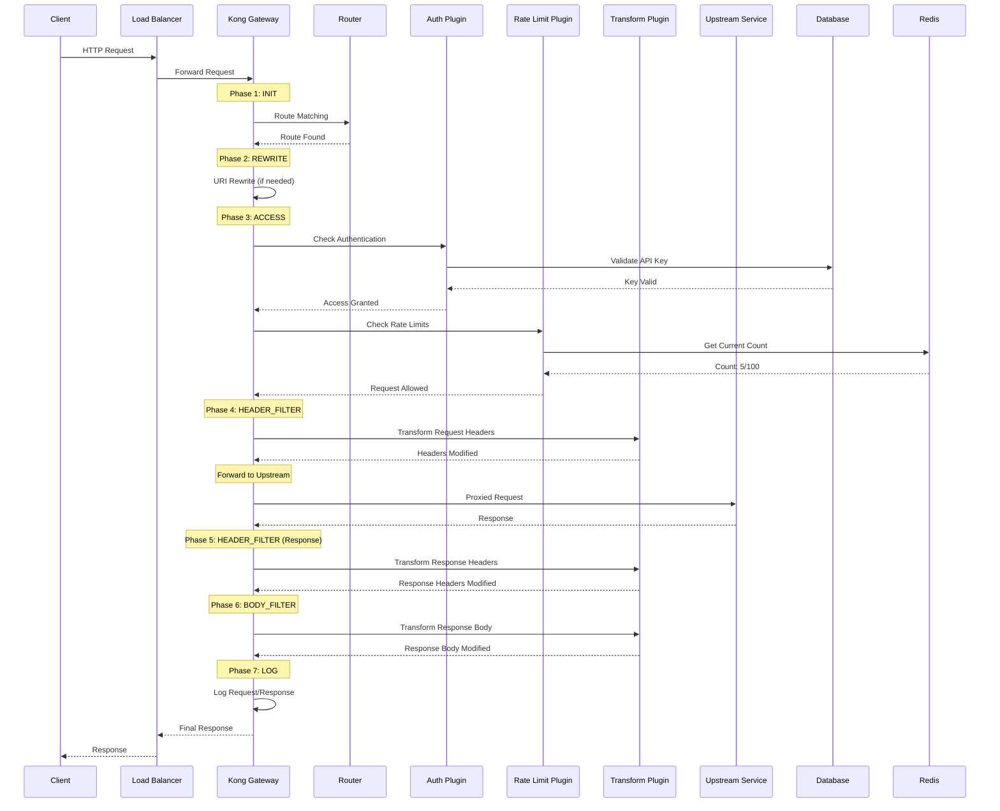
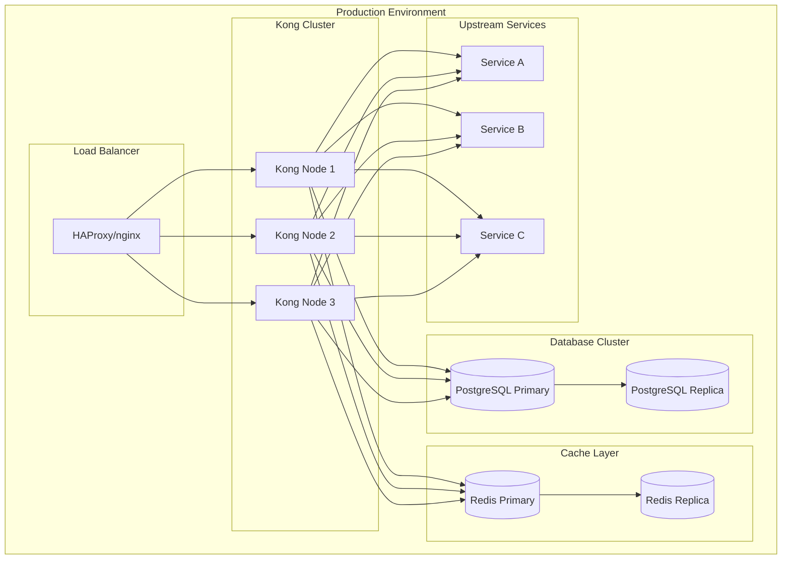
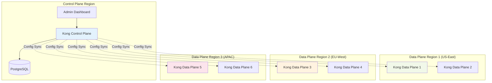
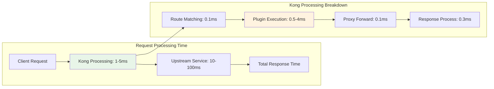
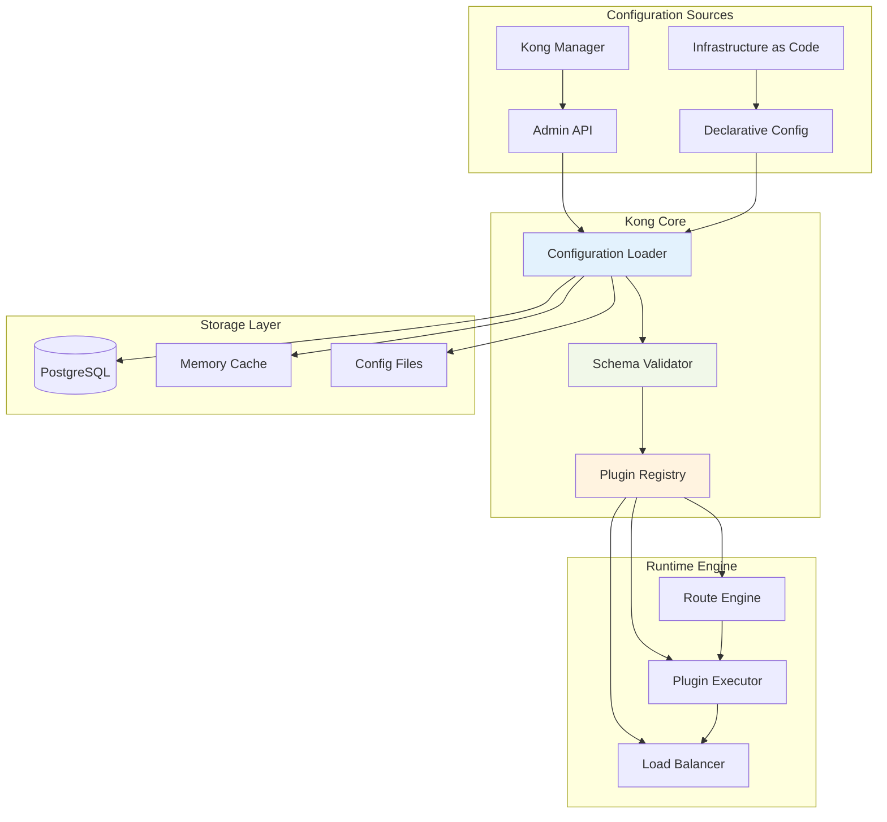

# 🌊 Kong Gateway - Fluxo de Dados Detalhado

## 📊 Diagrama de Fluxo Completo

## 🔄 Lifecycle de uma Requisição

## 📈 Arquitetura de Plugins

```mermaid
graph TD
    subgraph "Kong Core"
        A[Request Router]
        B[Plugin Manager]
        C[Load Balancer]
    end
    
    subgraph "Authentication Plugins"
        D[Key Auth]
        E[JWT]
        F[OAuth 2.0]
        G[LDAP]
    end
    
    subgraph "Security Plugins"
        H[Rate Limiting]
        I[IP Restriction]
        J[Bot Detection]
        K[CORS]
    end
    
    subgraph "Traffic Control"
        L[Request Size Limit]
        M[Response Rate Limit]
        N[Proxy Cache]
    end
    
    subgraph "Analytics & Monitoring"
        O[Prometheus]
        P[StatsD]
        Q[File Log]
        R[Datadog]
    end
    
    subgraph "Transformation"
        S[Request Transform]
        T[Response Transform]
        U[Correlation ID]
    end
    
    A --> B
    B --> D
    B --> E
    B --> F
    B --> G
    B --> H
    B --> I
    B --> J
    B --> K
    B --> L
    B --> M
    B --> N
    B --> O
    B --> P
    B --> Q
    B --> R
    B --> S
    B --> T
    B --> U
    B --> C
    
    style B fill:#e3f2fd
    style D fill:#f1f8e9
    style H fill:#fff3e0
    style O fill:#fce4ec
    style S fill:#e8eaf6
```

## 🏗️ Deployment Patterns

### Pattern 1: Single Region

### Pattern 2: Multi-Region (Hybrid)

## 📊 Performance Characteristics

## 🔧 Configuration Management

---

**💡 Use estes diagramas como referência visual durante o workshop!**
