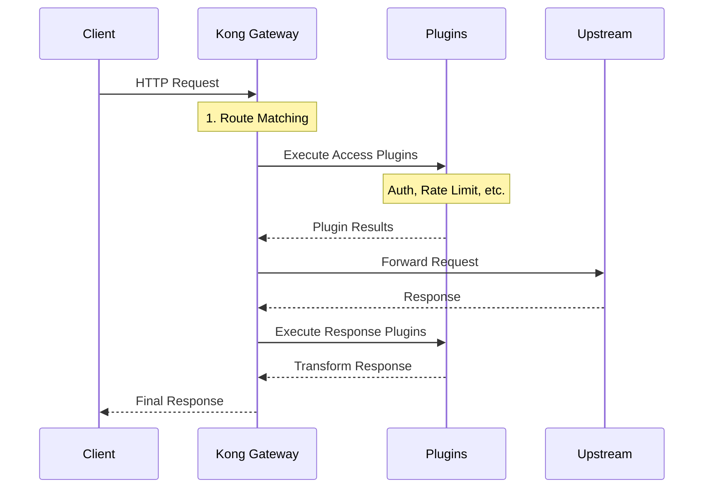

# 🏗️ Projeto 00: Arquitetura do Kong Gateway

## 🎯 Objetivo

Compreender a arquitetura fundamental do Kong Gateway antes de partir para implementações práticas. Este projeto apresenta os componentes principais, fluxos de dados e topologias de deployment.

## 🏛️ Arquitetura Kong - Visão Geral

```
┌─────────────────────────────────────────────────────────────────┐
│                        KONG GATEWAY                            │
├─────────────────────────────────────────────────────────────────┤
│                                                                 │
│  ┌─────────────┐    ┌─────────────┐    ┌─────────────┐         │
│  │   CLIENT    │────│    KONG     │────│  UPSTREAM   │         │
│  │   REQUEST   │    │   GATEWAY   │    │   SERVICES  │         │
│  └─────────────┘    └─────────────┘    └─────────────┘         │
│                                                                 │
└─────────────────────────────────────────────────────────────────┘
```

## 🧩 Componentes Principais

### 1. **Data Plane** (Plano de Dados)
- **Responsabilidade**: Processar requisições em tempo real
- **Porta**: 8000 (proxy), 8443 (proxy HTTPS)
- **Tecnologia**: OpenResty (Nginx + LuaJIT)
- **Função**: Executar plugins, roteamento, load balancing

### 2. **Control Plane** (Plano de Controle)  
- **Responsabilidade**: Configuração e administração
- **Porta**: 8001 (Admin API), 8444 (Admin API HTTPS)
- **Função**: CRUD de configurações, status, métricas

### 3. **Database** (Banco de Dados)
- **Opções**: PostgreSQL (recomendado) ou Cassandra
- **Função**: Persistir configurações (services, routes, plugins)
- **Alternativa**: DB-less mode (configuração declarativa)

### 4. **Plugin System** (Sistema de Plugins)
- **Linguagens**: Lua (nativo), Go, Python, JavaScript
- **Tipos**: Authentication, Security, Traffic Control, Analytics
- **Execução**: Durante fases do ciclo de vida da requisição

## 🔄 Fluxo de Requisição



## 🌐 Topologias de Deployment

### 1. **Traditional (Database)**
```
┌─────────────┐    ┌─────────────┐    ┌─────────────┐
│   Kong 1    │    │   Kong 2    │    │   Kong N    │
│             │    │             │    │             │
│ Data Plane  │    │ Data Plane  │    │ Data Plane  │
│Control Plane│    │Control Plane│    │Control Plane│
└─────┬───────┘    └─────┬───────┘    └─────┬───────┘
      │                  │                  │
      └──────────────────┼──────────────────┘
                         │
                ┌─────────▼──────────┐
                │    PostgreSQL      │
                │   (Shared DB)      │
                └────────────────────┘
```

### 2. **Hybrid Mode**
```
         ┌─── Control Plane ───┐
         │                    │
         │  ┌─────────────┐   │
         │  │ Admin API   │   │ 
         │  │ Database    │   │
         │  └─────────────┘   │
         └────────┬───────────┘
                  │
    ┌─────────────┼─────────────┐
    │             │             │
┌───▼───┐    ┌───▼───┐    ┌───▼───┐
│Data   │    │Data   │    │Data   │
│Plane 1│    │Plane 2│    │Plane N│
│       │    │       │    │       │
│(8000) │    │(8000) │    │(8000) │
└───────┘    └───────┘    └───────┘
```

### 3. **DB-less Mode**
```
┌─────────────┐    ┌─────────────┐    ┌─────────────┐
│   Kong 1    │    │   Kong 2    │    │   Kong N    │
│             │    │             │    │             │
│ kong.yml    │    │ kong.yml    │    │ kong.yml    │
│(config file)│    │(config file)│    │(config file)│
└─────────────┘    └─────────────┘    └─────────────┘
```

## 🔌 Sistema de Plugins - Fases de Execução

```
┌─────────────────────────────────────────────────────────────────┐
│                    PLUGIN EXECUTION PHASES                     │
├─────────────────────────────────────────────────────────────────┤
│                                                                 │
│  REQUEST  ────┐                                                 │
│               │                                                 │
│               ▼                                                 │
│         ┌─────────┐    ┌─────────┐    ┌─────────┐               │
│         │ REWRITE │ ──▶│ ACCESS  │ ──▶│ HEADER  │               │
│         └─────────┘    └─────────┘    └─────────┘               │
│                                           │                     │
│                                           ▼                     │
│                                    ┌─────────────┐              │
│                                    │  UPSTREAM   │              │
│                                    │   SERVICE   │              │
│                                    └─────┬───────┘              │
│                                          │                     │
│                                          ▼                     │
│         ┌─────────┐    ┌─────────┐    ┌─────────┐               │
│         │  BODY   │ ◀──│ HEADER  │ ◀──│RESPONSE │               │
│         └─────────┘    └─────────┘    └─────────┘               │
│               │                                                 │
│               ▼                                                 │
│          RESPONSE                                               │
│                                                                 │
└─────────────────────────────────────────────────────────────────┘
```

### Fases Detalhadas:

1. **REWRITE**: Modificações na URI antes do roteamento
2. **ACCESS**: Autenticação, autorização, rate limiting
3. **HEADER_FILTER**: Modificação de headers de request
4. **BODY_FILTER**: Modificação do body da response
5. **LOG**: Logging e analytics

## 📊 Componentes Internos (OpenResty)

```
┌───────────────────────────────────────────────────────────────┐
│                        OpenResty Stack                       │
├───────────────────────────────────────────────────────────────┤
│                                                               │
│  ┌─────────────────────────────────────────────────────────┐  │
│  │                  Kong Core                              │  │
│  │  ┌─────────────┐ ┌─────────────┐ ┌─────────────┐      │  │
│  │  │   Router    │ │   Plugins   │ │   Balancer  │      │  │
│  │  └─────────────┘ └─────────────┘ └─────────────┘      │  │
│  └─────────────────────────────────────────────────────────┘  │
│                                 │                             │
│  ┌─────────────────────────────▼─────────────────────────────┐  │
│  │                        LuaJIT                           │  │
│  │         (Just-In-Time Compilation)                      │  │
│  └─────────────────────────────┬─────────────────────────────┘  │
│                                 │                             │
│  ┌─────────────────────────────▼─────────────────────────────┐  │
│  │                        Nginx                            │  │
│  │    (Event Loop, HTTP Processing, SSL/TLS)               │  │
│  └─────────────────────────────────────────────────────────────┘  │
│                                                               │
└───────────────────────────────────────────────────────────────┘
```

## 🚀 Por que essa Arquitetura?

### 1. **Performance**
- **Nginx**: Event-driven, alta concorrência
- **LuaJIT**: Compilação just-in-time para scripts Lua
- **OpenResty**: Integração otimizada Nginx + Lua

### 2. **Flexibilidade**
- **Plugins**: Extensibilidade via múltiplas linguagens
- **Configuração**: Declarativa ou via API
- **Deployment**: Traditional, Hybrid, DB-less

### 3. **Escalabilidade**
- **Stateless**: Cada instância Kong é independente
- **Horizontal**: Fácil adicionar/remover nós
- **Load Balancing**: Distribuição automática de carga

### 4. **Observabilidade**
- **Métricas**: Prometheus, StatsD
- **Logs**: Estruturados, customizáveis
- **Tracing**: Integração com Jaeger, Zipkin

## 🛠️ Casos de Uso Arquiteturais

### 1. **Microservices Gateway**
```
Client ──▶ Kong ──┬──▶ User Service
                  ├──▶ Order Service  
                  ├──▶ Payment Service
                  └──▶ Notification Service
```

### 2. **Legacy Integration**
```
Mobile App ──▶ Kong ──┬──▶ New REST API
                      └──▶ Legacy SOAP Service
```

### 3. **Multi-Environment**
```
Kong (Prod) ──▶ Production Services
Kong (Stage) ──▶ Staging Services  
Kong (Dev) ──▶ Development Services
```

## 📈 Métricas e Monitoramento

```
┌─────────────────────────────────────────────────────────────────┐
│                    OBSERVABILITY STACK                         │
├─────────────────────────────────────────────────────────────────┤
│                                                                 │
│  ┌─────────────┐    ┌─────────────┐    ┌─────────────┐         │
│  │ Prometheus  │    │  Grafana    │    │   Jaeger    │         │
│  │ (Metrics)   │    │(Dashboard)  │    │ (Tracing)   │         │
│  └─────┬───────┘    └─────┬───────┘    └─────┬───────┘         │
│        │                  │                  │                 │
│        └──────────────────┼──────────────────┘                 │
│                           │                                    │
│  ┌────────────────────────▼────────────────────────┐           │
│  │                   KONG GATEWAY                  │           │
│  │                                                 │           │
│  │  ┌─────────────┐ ┌─────────────┐ ┌─────────────┐ │           │
│  │  │Prometheus   │ │   Logging   │ │  Tracing    │ │           │
│  │  │Plugin       │ │  Plugin     │ │  Plugin     │ │           │
│  │  └─────────────┘ └─────────────┘ └─────────────┘ │           │
│  └─────────────────────────────────────────────────┘           │
│                                                                 │
└─────────────────────────────────────────────────────────────────┘
```

## 🎓 Próximos Passos

Agora que você entende a arquitetura Kong, está pronto para:

1. **[Projeto 01](../01-basic-proxy/)** - Implementar um proxy básico
2. **[Projeto 02](../02-authentication/)** - Adicionar autenticação
3. **[Projeto 03](../03-rate-limiting/)** - Controlar tráfego
4. **...continuar a jornada Kong!**

---

## 📚 Recursos Adicionais

- [Kong Documentation](https://docs.konghq.com/)
- [OpenResty Documentation](https://openresty.org/)  
- [Kong Community](https://discuss.konghq.com/)
- [Kong GitHub](https://github.com/Kong/kong)

**💡 Dica**: Use este projeto como referência durante toda a jornada do workshop!
